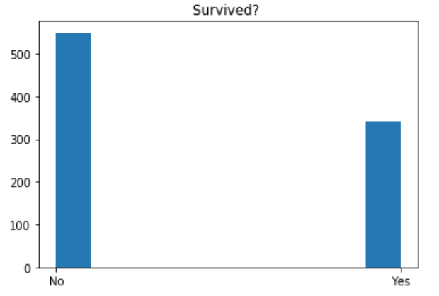
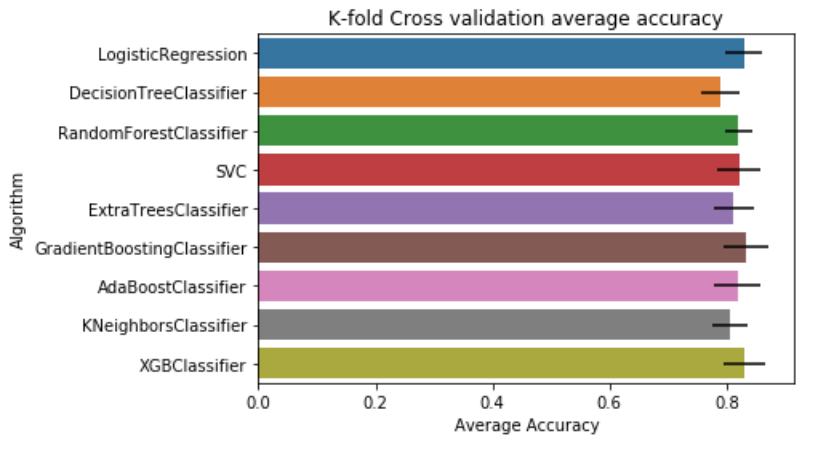
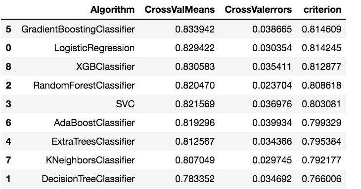
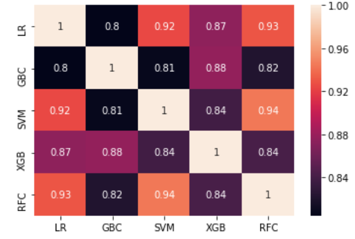

# Spooky-Authors-Identification

This repository presents my submission in the [Titanic: Machine Learning from Disaster, Kaggle Competition](https://www.kaggle.com/c/titanic).  
In this competition, the <b>goal</b> is to perform a 2-label <b>classification problem</b>: predict which <b>passengers survived</b> the tragedy.   [Kaggle](https://www.kaggle.com) offers two datasets. One training (the labels are known) and one testing (the labels are unknown). The goal is to submit a file with our predicted labels saying who survived or not.  

We have access to a bunch of 9 features (numerical, text, categorical). The <b>big challenge</b> with this competition is the size of the data we have. The <b>training set</b> is composed of only <b>891 samples</b>. The testing set is composed of 418 samples.  Therefore, the main issue is to design an algorithm which generalizes enough in order to avoid <b>over-fitting</b>. To do so, a bunch of features is generated. Then, an ensemble modeling method with voting is used in order to get the most generalized model.  

This is a multi-label classification, with 2 labels:

- 0: passenger did not survive
- 1: passenger survived

[Kaggle](https://www.kaggle.com) offers 2 datasets:
- One Training set: 891 passengers whose label is known
- One Test set (TS0): 418 passengers whose label is unknown

Goal: For each passenger, predict the label (0 or 1).

The evaluation metric is accuracy score. 

The project is decomposed in 3 parts:

The framework of this notebook is:
- Preliminary Work:
    - General Exploration
    - NaN values
    - Feature Exploration
- Analysis of the features
    - Categorical and Integer Numerical
    - Numerical
    - Text
- Feature Engineering
- Modeling
    - Simple Models & Selection
    - Hyper-Parameters Optimization 
    - Ensemble Modeling
- Submission

For this competition, the current Kaggle Leaderboard accuracy I reached is 0.79904. 

## Preliminary Work

In the training dataframe, we observe that the 2 label are slightly balanced (61% labeled as 0). We also see we have access to 16 different features per passengers.   4 of the features have missing values:

- Age: Age is fractional if less than 1. If the age is estimated, is it in the form of xx.5 -> Numerical Variable
- Cabin: Cabin number -> Categorical variable
- Embarked: Port of Embarkation (3 categories)  -> Categorical variable
- Fare: Numerical: Only 1 missing in the test dataset. Can be replace by the mean in the training set. 

The notebook details how the NaNs are treated. 

## Analysis of the features

### Categorical & Integer Numerical Features

For this type of feature, we can observe the average survival of passengers within each categories. The observed features are: 

- PClass
- Sex
- Embarked
- SibSp
- Parch

Conclusion:

- Pclass and Sex has a great correlation with the survival of people -> Keep directly them as features
- SibSp & Parch have a sort of correlation but feature engineering is required: We can sum the two and then know:
	- if the passenger was alone 
	- if the passenger was with a big or a small family
- Embarked: 3 labels with no assumed order -> one-hot encoding 

### Numerical Features

For this type of feature, we can observe the distribution of the passengers given the survival. The observed features are: 

- Age
- Fare

<u>Conclusion:</u>
- Younger and older people survived.
- The middle age (20-40) people did not survive. 
- We should consider the age as predictor
- Fare is less clear
- Age is skewed and Fare is highly skewed  -> [Box-Cox Transformation](https://docs.scipy.org/doc/scipy/reference/generated/scipy.stats.boxcox.html) is required

### Text Features

For this type of features, we don't directly do analysis. A first transformation is needed. The observed features are:

- Cabin
- Name 

<u>Engineering:</u>
- Cabin: We can extract two informations: 
	- if a passenger has a cabin 
	- what is the letter of the cabin deck and so we have an estimate of the position of the passenger in the boat
- Name: We can extract one information:
	- the title of the passenger
	- Group the title to reduce the number of categories

## Feature Engineering

In this part, I designed the features following the previous part. I ended with the following features:

- PClass
- Title (engineered from Name)
- Sex
- Age
- FamilyType (engineered from SibSp + Parch)
- Prefix (engineered from Ticket - it's the prefix of the ticket)
- Fare
- cabin_letter (engineered from the Cabin)
- Embarked 

## Modeling

###Simple Models & Selection

I chosed several classifiers and compared them using [k-fold cross validation](https://en.wikipedia.org/wiki/Cross-validation_(statistics)).  

K-fold is important here (in the case of a small dataset) because it enables us to train/test the model 10 times and then we can reduce the chance of over-fitting or even luck.

The models tried for this bi-label classification problem will be:
- Logistic Regression
- Decision Tree
- Random Forest
- SVM
- ExtraTree
- Gradient Boosting
- AdaBoost
- KNN 
- XGBoost

The different algorithms perform differently. We need to look at the average, but also at the standard deviation of the accuracy of these algorithms. Indeed, we want our model to perform well on average, but we don't want it to perform really poorly sometimes or really greatly on other times. 
I decided to use a hand-crafted criterion in order to take into account both average and deviation. The criterion is defined as the average minus the half of the deviation. So we take the algorithm with the best accuracy modulated by a not to big deviation.

Gradient Boosting produces the best outcome in terms of criterion. We can directly use it to produce the submission file.  
Or we can decide to use different models and ensemble the results in order to produce a better outcome: this method is so-called 'Ensemble modeling'. 
To select the best ones, I use a criterion which is the mean of the accuracy minus the half of the standard deviation of the accuracy.  
But first, let's select the 5 best algorithms in order to perform hyper-parameters optimization:
- LogisticRegression
- GradientBoosting
- XGBoost
- SVM
- RandomForest	

###Hyper-Parameters Optimization 

In this part, I tried to improve the accuracy of the selected classifiers by hyper-parameters optimization. To do so, I used a Scikit-Learn implemented tool in order to perform a grid search.

###Ensemble Modeling

The classifier are quiet correlated. This is a good sign! However we observe some differences between the 5 classifiers. This is good for you because we can leverage the use of a voting system to improve our prediction.

## Submission

My submitted file is: titanic-predictions.csv. 

## Author

* **Selim Amrouni** [selimamrouni](https://github.com/selimamrouni)

